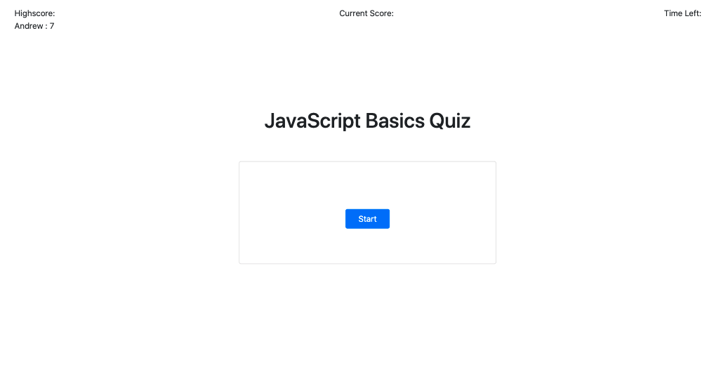

# quiz-app

* [Description ](#description)
* [Next Steps](#next-steps)
* [Installation and Usage](#installation-and-usa)
* [License](#license)

# Description

This is a simple, multiple-choice quiz app, developed with the intention of becoming a template for companies to administer onboarding tests. Upon pressing "start", the user is present with a question and four answer choices. Choosing an incorrect answer will display a brief "wrong!" message; whereas choosing a correct answer will display a brief "correct!" message, and display a new question. The game concludes once the all the questions have been answered. Upon completion, the user submits their name and score, which will be stored so management can review and follow up if needed. The user is then presented with a final message thanking them for their time and giving instructions for any next steps. 

This page has been deployed on Github, and can be viewed here:  https://tomekregulski.github.io/quiz-app/

# Next Steps

-The styling is at a mid-point. I will likely remove Bootstrap and redo everything from scrath to make it all more flexible. 
-There is some functionality left over from a previous approach to how score is kept, and how the user progrersses through the quiz. This needs to be updated in order to be in line with the current objectives of this app. 

# Installation and Use

Clone the repo and open the folder in the code editor of your choice. 

# License

MIT License

Copyright (c) [2021] [Tomek Regulski]

Permission is hereby granted, free of charge, to any person obtaining a copy
of this software and associated documentation files (the "Software"), to deal
in the Software without restriction, including without limitation the rights
to use, copy, modify, merge, publish, distribute, sublicense, and/or sell
copies of the Software, and to permit persons to whom the Software is
furnished to do so, subject to the following conditions:

The above copyright notice and this permission notice shall be included in all
copies or substantial portions of the Software.

THE SOFTWARE IS PROVIDED "AS IS", WITHOUT WARRANTY OF ANY KIND, EXPRESS OR
IMPLIED, INCLUDING BUT NOT LIMITED TO THE WARRANTIES OF MERCHANTABILITY,
FITNESS FOR A PARTICULAR PURPOSE AND NONINFRINGEMENT. IN NO EVENT SHALL THE
AUTHORS OR COPYRIGHT HOLDERS BE LIABLE FOR ANY CLAIM, DAMAGES OR OTHER
LIABILITY, WHETHER IN AN ACTION OF CONTRACT, TORT OR OTHERWISE, ARISING FROM,
OUT OF OR IN CONNECTION WITH THE SOFTWARE OR THE USE OR OTHER DEALINGS IN THE
SOFTWARE.