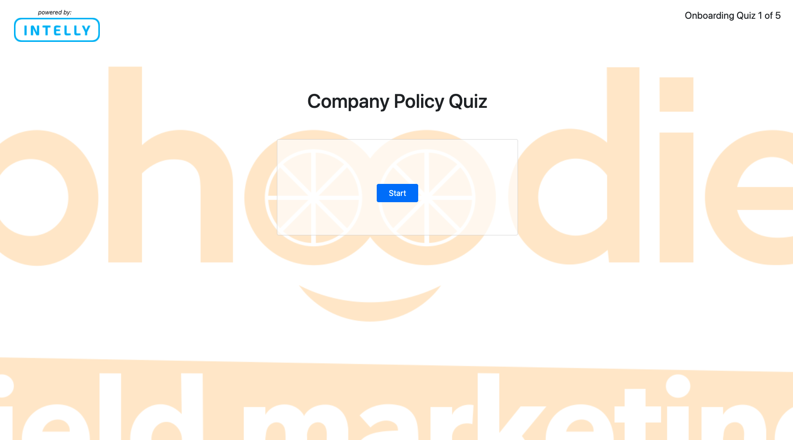

# quiz-app

* [Description ](#description)
* [What I Learned](#what-i-learned)
* [Installation and Usage](#installation-and-usa)
* [License](#license)

# Description

This is a simple, multiple-choice quiz app. Upon pressing "start", the user is present with a question and four answer choices. Choosing an incorrect answer will display a brief "wrong!" message, and subtract 4 seconds from the time remaining. Choosing a correct answer will display a brief "correct!" message, increase the score by 1, and display a new question. The game concludes once the timer reaches 0, or if the user manages to answer all the questions. At this point, the user is given the opportunity to submit their name and score, which will be added as a key:value pair to the leaderboard object array, which is stored in localStorage. If the score is the new high score, then the user's name and score will be displayed as the high score once the game resets. The final screen is the leaderboard, which shows to top 4 scores form the leaderboard object array.

This page has been deployed on Github, and can be viewed here:  https://tomekregulski.github.io/quiz-app/

# What I Learned

-organizing and coordinating complex actions via JS
-leaning on JS to create a dynamic page while keeping HTML minimal
-create, style, and remove elements through JS
-utilize Bootstrap's styling
-work with a timer in JS
-use an object array to display specific information based on triggers
-use event listeners to coordinate a sequence of actions and create an interactive experience
-use arrays and local storage to save and recall information
-sort through an object array based on a shared value
-think through a full game and consider what is necessary in order to make the experience complete

# Installation and Use

Clone the repo and open the folder in the code editor of your choice. 

# License

MIT License

Copyright (c) [2021] [Tomek Regulski]

Permission is hereby granted, free of charge, to any person obtaining a copy
of this software and associated documentation files (the "Software"), to deal
in the Software without restriction, including without limitation the rights
to use, copy, modify, merge, publish, distribute, sublicense, and/or sell
copies of the Software, and to permit persons to whom the Software is
furnished to do so, subject to the following conditions:

The above copyright notice and this permission notice shall be included in all
copies or substantial portions of the Software.

THE SOFTWARE IS PROVIDED "AS IS", WITHOUT WARRANTY OF ANY KIND, EXPRESS OR
IMPLIED, INCLUDING BUT NOT LIMITED TO THE WARRANTIES OF MERCHANTABILITY,
FITNESS FOR A PARTICULAR PURPOSE AND NONINFRINGEMENT. IN NO EVENT SHALL THE
AUTHORS OR COPYRIGHT HOLDERS BE LIABLE FOR ANY CLAIM, DAMAGES OR OTHER
LIABILITY, WHETHER IN AN ACTION OF CONTRACT, TORT OR OTHERWISE, ARISING FROM,
OUT OF OR IN CONNECTION WITH THE SOFTWARE OR THE USE OR OTHER DEALINGS IN THE
SOFTWARE.